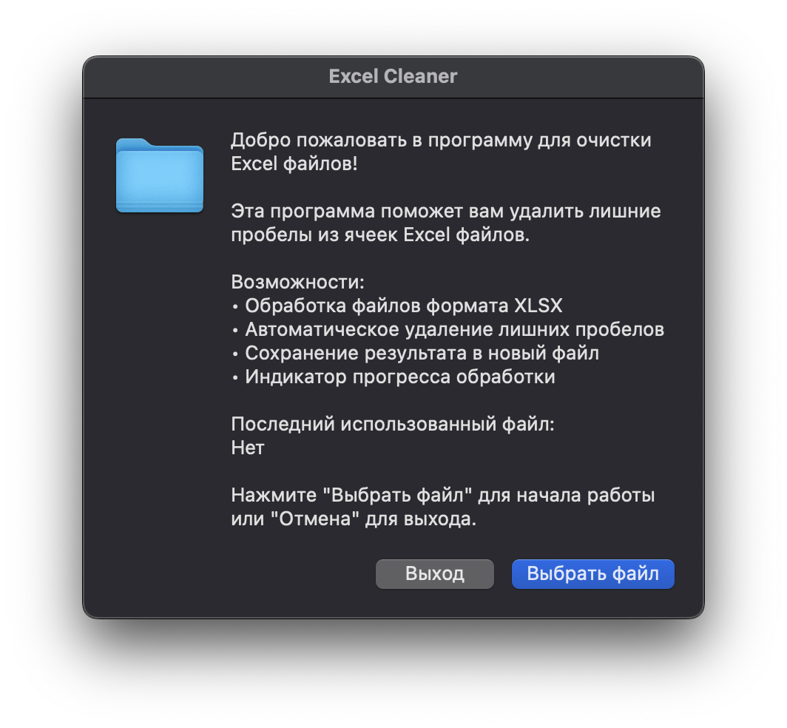

# Excel Cleaner

Excel Cleaner - это утилита для автоматического удаления лишних пробелов из ячеек Excel файлов. Программа предоставляет удобный графический интерфейс и поддерживает файлы формата XLSX.



## Возможности

- 📝 Автоматическое удаление пробелов в начале и конце ячеек
- 📊 Поддержка файлов формата XLSX
- 🔄 Обработка нескольких листов в одном файле
- 📈 Индикатор прогресса с возможностью отмены
- 📊 Подробная статистика обработки
- 💾 Сохранение результата в новый файл
- 🎯 Запоминание последних использованных путей

## Установка

### Требования

- Go 1.21 или выше
- Операционная система: Windows, macOS или Linux

### Из исходного кода

```bash
# Клонируем репозиторий
git clone https://github.com/24example/excel-cleaner.git
cd excel-cleaner

# Устанавливаем зависимости
go mod download

# Собираем программу
go build
```

## Использование

1. Запустите программу:

   ```bash
   ./excel-cleaner
   ```

2. В главном окне нажмите кнопку "Выбрать файл"

3. Выберите Excel файл формата XLSX для обработки

4. Дождитесь завершения обработки:

   - Прогресс отображается в реальном времени
   - Можно отменить обработку в любой момент
   - После завершения показывается статистика

5. Выберите путь для сохранения обработанного файла

6. При необходимости обработайте следующий файл

## Особенности работы

- Программа сохраняет структуру исходного файла
- Пустые ячейки остаются пустыми
- Форматирование ячеек сохраняется
- Поддерживаются файлы любого размера
- Обрабатываются все листы в файле

## Разработка

### Структура проекта

```
excel-cleaner/
├── main.go          # Основной код программы
├── main_test.go     # Unit тесты
├── go.mod           # Зависимости
├── go.sum           # Хеши зависимостей
├── README.md        # Документация
└── docs/            # Дополнительная документация
    └── screenshot.png
```

### Запуск тестов

```bash
# Запуск всех тестов
go test

# Запуск тестов с подробным выводом
go test -v

# Проверка покрытия кода тестами
go test -cover
```

### Тестовые сценарии

1. Удаление пробелов в начале и конце
2. Обработка пустых ячеек
3. Обработка смешанных данных
4. Обработка неравномерных строк
5. Сохранение настроек

## Зависимости

- [github.com/ncruces/zenity](https://github.com/ncruces/zenity) - Системные диалоги
- [github.com/xuri/excelize/v2](https://github.com/qax-os/excelize) - Работа с Excel файлами

## Лицензия

MIT License - см. файл [LICENSE](LICENSE)

## Автор

Pavel Sinitsin - [GitHub](https://github.com/24example)

## Участие в разработке

1. Форкните репозиторий
2. Создайте ветку для новой функции (`git checkout -b feature/amazing-feature`)
3. Зафиксируйте изменения (`git commit -m 'Add amazing feature'`)
4. Отправьте изменения в ваш форк (`git push origin feature/amazing-feature`)
5. Откройте Pull Request

## Планы на будущее

- [ ] Поддержка форматов XLS и XLSM
- [ ] Дополнительные опции обработки (удаление двойных пробелов и т.д.)
- [ ] Пакетная обработка нескольких файлов
- [ ] Сохранение пользовательских настроек
- [ ] Поддержка регулярных выражений для поиска и замены

## Часто задаваемые вопросы

**В: Безопасно ли использовать программу для важных файлов?**  
О: Да, программа всегда создает новый файл и не изменяет исходный.

**В: Какой максимальный размер файла поддерживается?**  
О: Ограничение зависит только от доступной памяти компьютера.

**В: Сохраняется ли форматирование ячеек?**  
О: Да, все форматирование (цвета, шрифты, границы) сохраняется.

## Поддержка

Если у вас возникли проблемы или есть предложения:

1. Проверьте раздел [Issues](https://github.com/24example/excel-cleaner/issues)
2. Создайте новый Issue с подробным описанием
3. Для срочных вопросов: thejoker.msk@mail.ru
